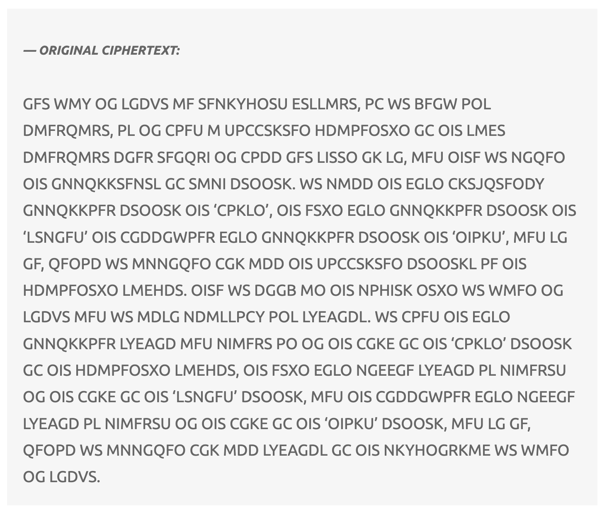
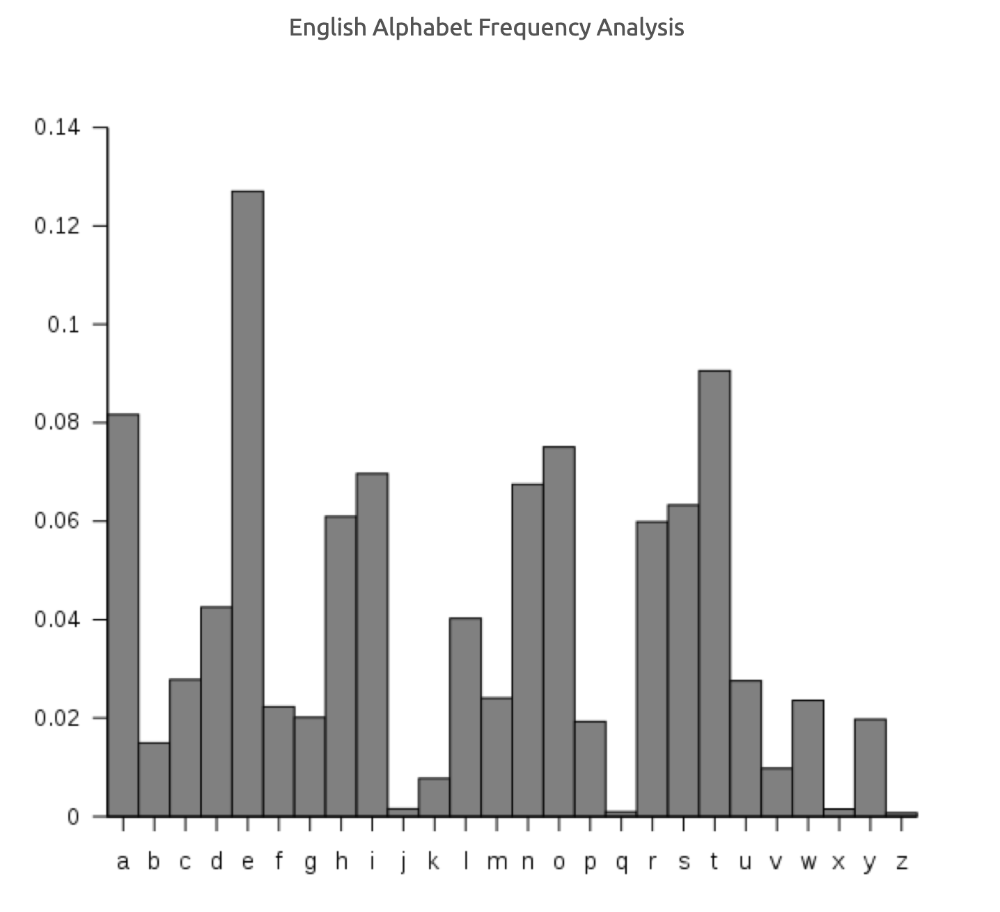
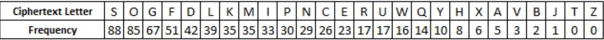
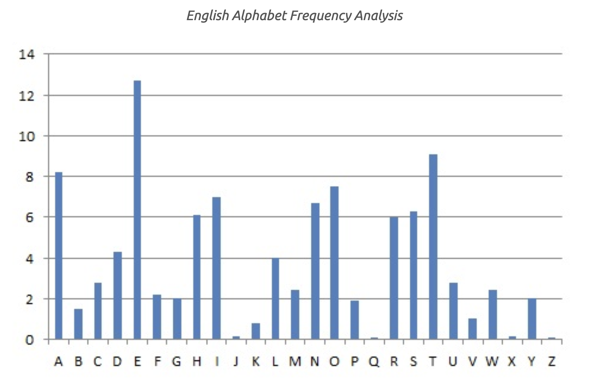
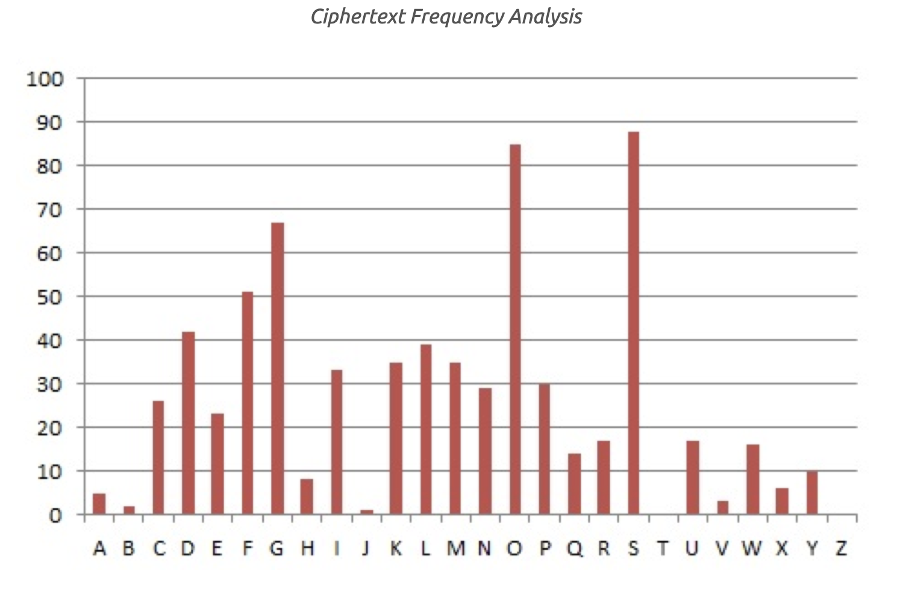
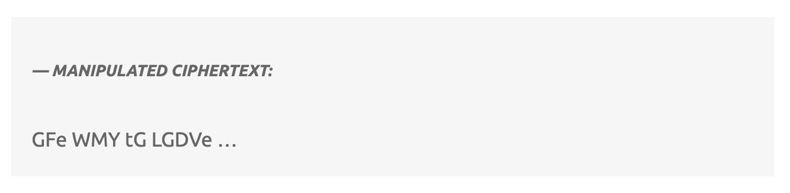
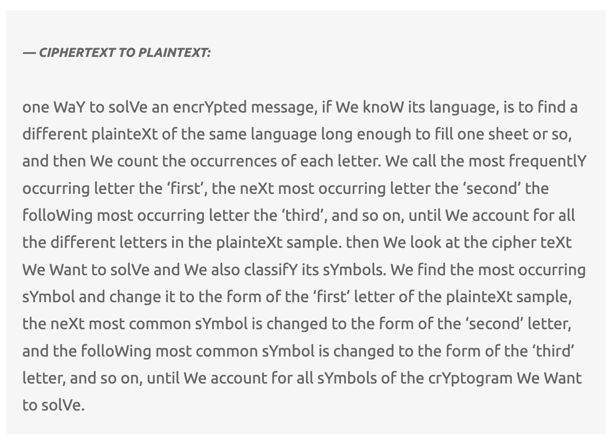
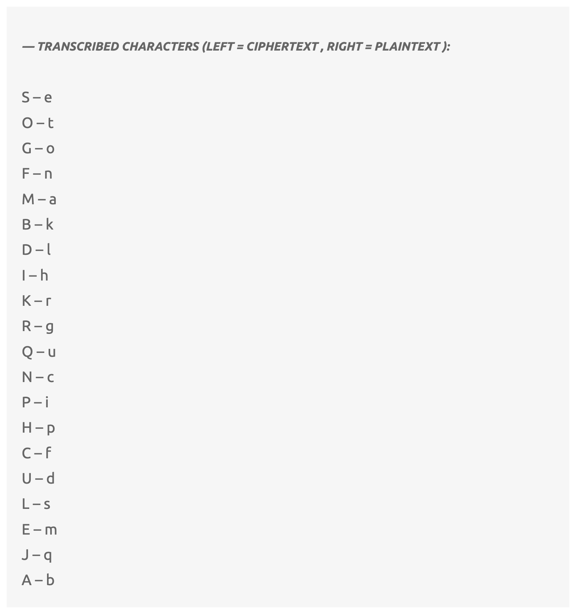

# CSC738-cybersecurity-assignment
# Task 2 - Cryptanalysis and mono-alphabetic substitution ciphers

## Contents
[Introduction](#introduction)

[Original ciphertext](#original-ciphertext)

[Hypothesis and Methodology](#hypothesis-and-methodology)

[Why is this useful](#why-is-this-useful)

[Discussion](#discussion)

[Conclusion](#conclusion)

## Introduction
[Go to Top](#top)

The report that follows presents in-sight on a cryptanalysis method that is used for decrypting a mono-alphabetic cipher, without having access to the cipher key. After following the cryptanalysis method in this report, the plaintext message of original ciphertext is revealed. This is a simple cryptanalysis method implemented against a modest substitution – a mono-alphabetic substitution cipher.

The following image, figure 1, is the required ciphertext to crack. It is analysed against frequency analysis, the cryptanalysis method used in this report.

## Original ciphertext
[Go to Top](#top)

Figure 1: Image displaying the original ciphertext to decrypt.

## Hypothesis and Methodology

Frequency cryptanalysis is the reading of statistical data and incorporating/manipulating such data to ciphertext, so that valid English words could be analysed as depicted in figure 2[1,2]:
    

Figure 2: Image displaying the frequency analysis of the English alphabet.

There is a correlation between the data set above and the percentage frequency of common letter in the English vocabulary. As depicted in figure 2, “E” is the most common letter existing in >12% of all English words.

## Why is the table in figure 2 useful

When the same frequency analysis is performed on the original ciphertext, the following data is obtained. Figure 3 below illustrates the data obtained:

[1,2]

Figure 3: Image displaying the data obtained by applying frequency analysis on the original ciphertext

Therefore, when this data is compared to the table data in Figure 2(English alphabet frequency table), some of the substitution decisions are then made. Moreover, the frequency table of the English alphabet is visually compared with the frequency table of the ciphertext below. This is used to simplify the process of finding a probable substitution for the original ciphertext:

Figure 4: Image displaying the different frequency tables for the English language and the original ciphertext respectively. 

Based on the above tables, deductions can be made. The most common occurrence in the English alphabet is “E” then “T” and in the original ciphertext it is “S” then “O”. Therefore by analysing the tables all “S” letters in the ciphertext is replaced with “E”. Equally “O” can be replaced with “T”.

Therefore the first four words of our ciphertext then appears as follows:

Figure 5: Image displaying the manipulated ciphertext.

Then upon viewing the manipulated ciphertext, “tG” would most likely be replaceable with an English word that substitutes “G” for an “o”, therefore making the word “to”. Now after updating all the "tg" words in the ciphertext, there seemed to be some sort of pattern. Based on this observation, it is certain that this assumption made for “tG” is valid. 

## Results

Then by applying the same deductions, more potential words are found. Similarly after performing more letter frequency correlations, more plaintext words are found, and we are able to make more educated assumptions.

Eventually, the ciphertext becomes more readable and ends up as plaintext:

Figure 6: Image displaying the plaintext for the original ciphertext.

Finally, the following list in figure 7 is obtained by applying the educated guesses, frequency analysis and common knowledge of the English language. Of course the letter not present in the list are paired with the same letter. For instance, "z" was paired with "z".

[1,2]

Figure 7: Image displaying all the ciphertext characters with their corresponding plaintext.

## Discussion

Frequency analysis is a valuable tool for deciphering monoalphabetic substitution ciphers, even those employing symbols instead of letters, and it can be applied to any language given the appropriate letter frequency data. However, it does possess a notable vulnerability. This weakness becomes evident when dealing with short ciphertexts because the limited text length doesn't provide enough data to accurately reflect the established letter frequencies. Consequently, the frequencies observed in a small text can deviate significantly from the standard[1,2].

Another factor that can influence letter frequencies in a text is its subject matter. For instance, if the message pertains to "zebras," the letter "z" is likely to appear more frequently than in typical writing. While this can disrupt frequency analysis, it can be overcome by employing complementary decryption techniques.

Certain texts intentionally manipulate letter frequencies in the plaintext. An extreme example of this is Georges Perec's 1969 work, "La Disparition," which spans 300 pages and deliberately omits the letter "e" except for the author's name. An English translation titled "A Void" by Gilbert Adair, published in 1995, adhered to the same constraints. Although such cases are rare, they serve as a reminder to cryptanalysts that the character of a language can be deliberately altered in a piece of writing, prompting the consideration of multiple traits beyond just frequency when attempting to break a code.

Furthermore, if the intercepted message employs an extended alphabet that includes punctuation and digits, it becomes necessary to determine the frequencies of these additional characters. While punctuation tends to follow certain conventions, the appearance of digits can vary widely depending on the text's context. This added complexity can extend the decryption process, but with some thoughtful analysis and patience, these ciphers can still be deciphered relatively easily.

## Conclusion
In conclusion, this report delves into a cryptanalysis method designed to decrypt mono-alphabetic ciphers, all while bypassing the need for the original cipher key. By following the steps outlined in this report, the encrypted message's plaintext is ultimately unveiled. This method, though straightforward, effectively addresses the challenge of deciphering modest substitution ciphers, making it a valuable addition to the arsenal of cryptanalysts and enthusiasts alike.

## References
[1] https://xorcrypt.wordpress.com/2016/04/20/cryptanalysis-via-frequency-analysis-basic/

[2] https://crypto.interactive-maths.com/frequency-analysis-breaking-the-code.html

[3] https://codelabs.developers.google.com/codelabs/mlkit-android#0

[Go to Top](#top)
